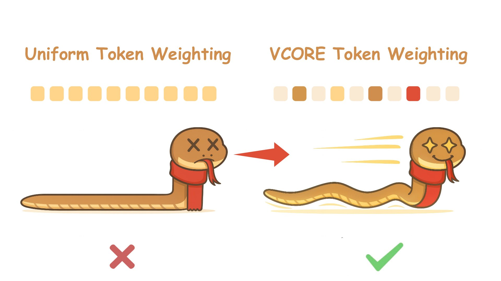
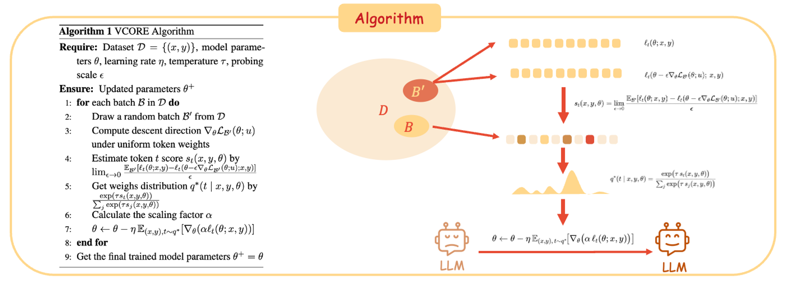
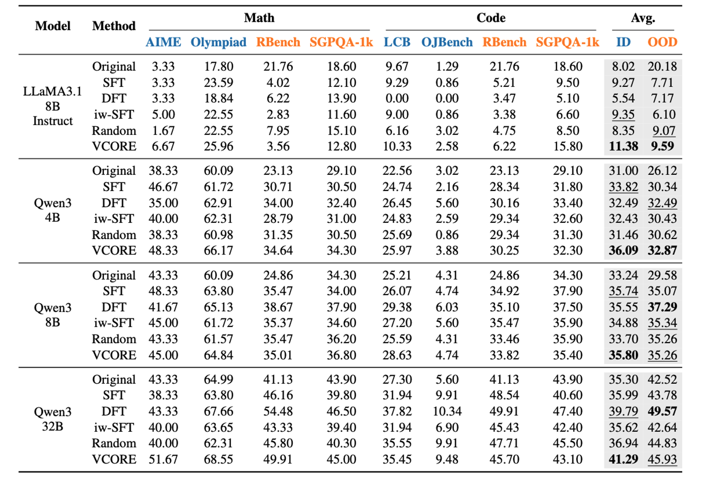
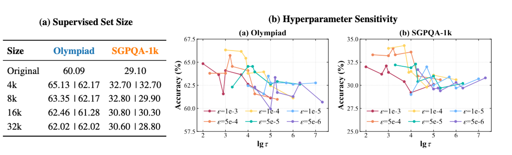
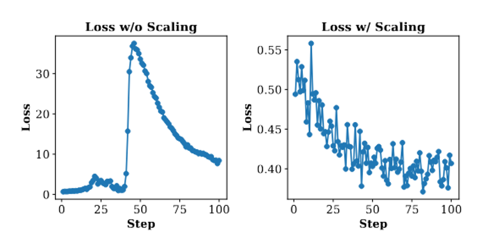
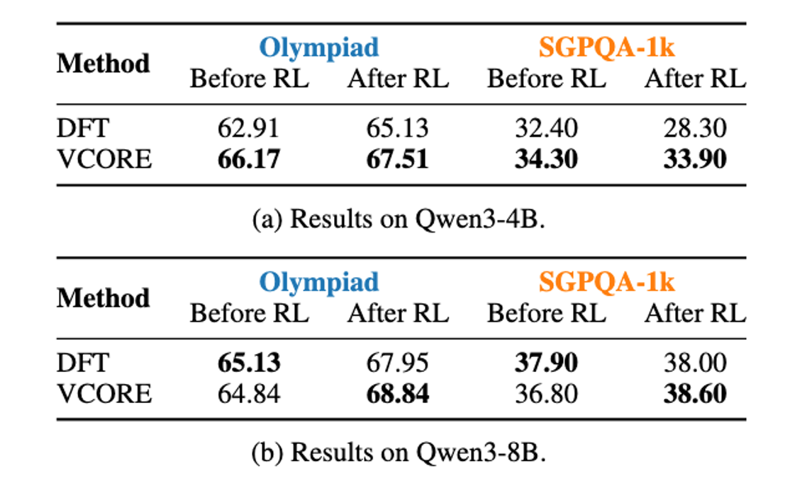

# VCORE
The official repository for the paper "VCORE: Variance-Controlled Optimization-based Reweighting for Chain-of-Thought Supervision"

<p align="center">
  
</p>

## 🔥 News
- [x] Our paper has been accepted to ACL 2026 Main Conference  6/4/2026
- [ ] Evaluation code and all scripts
- [x] Basic training code based on [LLaMA-Factory](https://github.com/hiyouga/LLaMA-Factory) frmework uploaded  
- [x] Preprint Paper. [](https://arxiv.org/abs/2510.27462).
- [x] Training dataset ([](https://huggingface.co/datasets/XanderGong/VCORE-data)) in huggingface
 format uploaded


  
## 🌟 Key Highlights
1. Beyond heuristics: take token weighting as optimization, not guesswork.
2. Improving both in-domain accuracy and out-of-domain generalization.
3. Serves as a more effective initialization for subsequent RL.

## 🚀 Quick Start
### Prepare Code and Data
```bash
git clone https://github.com/coder-gx/VCORE.git
cd VCORE
```
Download the training data form huggingface. [](https://huggingface.co/datasets/XanderGong/VCORE-data) 

change the data path in [data_info.json](./llama_factory/data/dataset_info.json) file of the llamafactory framework.

### Environment Setup
```bash
conda create -n vcore python==3.10
conda activate vcore
pip install torch==2.7.0 torchvision==0.22.0 torchaudio==2.7.0 --index-url https://download.pytorch.org/whl/cu128
pip install -r requirements.txt 
pip install -e ./llama_factory
pip install -e ./transformers-4.52.4
```
### Start training
We have two kinds of methods to run VCORE, multi-process one and single-process one.
#### 1. single process
There is training command examples in [train_single.sh](./llama_factory/train_single.sh), and you can change the hyperparameters to run the different training settings.
```bash
bash train_multi_single.sh
```
#### 2. multi process
There is training command examples in [train_multi_main.sh](./llama_factory/train_multi_main.sh) and [train_multi_branch.sh](./llama_factory/train_multi_branch.sh), and you can change the hyperparameters to run the different training settings.
```bash
bash train_multi_main.sh
bash train_multi_branch.sh # run at a different shell
```


## 📖 Methodology
New Perspective on CoT Supervision: 

(1) Optimization-Derived Weighting.

(2) Variance-Controlled Stabilization.

<p align="center">
  
</p>

## 📊 Results

### 1. Generalization 
- VCORE demonstrates the best overall performance, achieving strong in-domain accuracy and robust out-of-domain generalization across different models and domains.

- VCORE yields larger improvements on smaller and less capable models, with 
     gains scaling positively with the strength of larger models. 
<p align="center">
  
</p>

### 2. Ablation
- As the training dataset scales up, VCORE consistently maintains its advantage over DFT method
- Optimization-derived reweighting hyperparameter sensitivity
<p align="center">
  
</p>

- Variance control is critical for stabilizing sharp reweighting and ensuring reliable convergence.
<p align="center">
  
</p>


### 3. Foundation for RL
- VCORE offers a more capable foundation model to support reasoning tasks in reinforcement learning. 

<p align="center">
  
</p>

